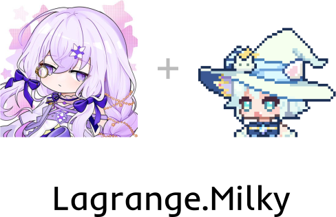

_[Milky](https://github.com/SaltifyDev/milky) protocol implementation based on [Lagrange.Core V2](https://github.com/LagrangeDev/LagrangeV2)_

## Document

https://lagrangedev.github.io/Lagrange.Milky.Document

## Feature List

- Api
  - [ ] Http
- Event
  - [ ] SSE
  - [x] WebSocket
  - [ ] WebHook

### api

No APIs have been implemented.

### event

- [x] bot_offline
- [x] message_receive
- [x] message_recall
- [ ] peer_pin_change
- [x] friend_request
- [x] group_join_request
- [x] group_invited_join_request
- [x] group_invitation
- [ ] friend_nudge
- [ ] friend_file_upload
- [ ] group_admin_change
- [ ] group_essence_message_change
- [x] group_member_increase
- [x] group_member_decrease
- [ ] group_name_change
- [x] group_message_reaction
  - [ ] reaction_type - It will only return "face"
- [ ] group_mute
- [ ] group_whole_mute
- [x] group_nudge
- [ ] group_file_upload

### models

- [x] Friend
- [x] FriendCategory
- [x] Group
- [x] GroupMember
- [ ] GroupAnnouncement
- [ ] GroupFile
- [ ] GroupFolder
- [ ] FriendRequest
- [ ] GroupNotification
  - [ ] join_request
  - [ ] admin_change
  - [ ] kick
  - [ ] quit
  - [ ] invited_join_request
- [x] IncomingMessage
  - [x] friend
  - [x] group
  - [x] temp
    - [ ] group - It will only return null
- [ ] IncomingForwardedMessage
- [ ] GroupEssenceMessage
- [x] [IncomingSegment](#imcoming-segment)
- [ ] OutgoingForwardedMessage
- [ ] [OutgoingSegment](#outgoing-segment)

### imcoming segment

- [x] text
- [x] mention
- [x] mention_all
- [ ] face
- [x] reply
- [x] image
- [x] record
- [x] video
- [ ] file
- [x] forward
  - [ ] title
  - [ ] preview
  - [ ] summary
- [ ] market_face
- [x] light_app
- [ ] xml

### imcoming forward segment

### outgoing segment